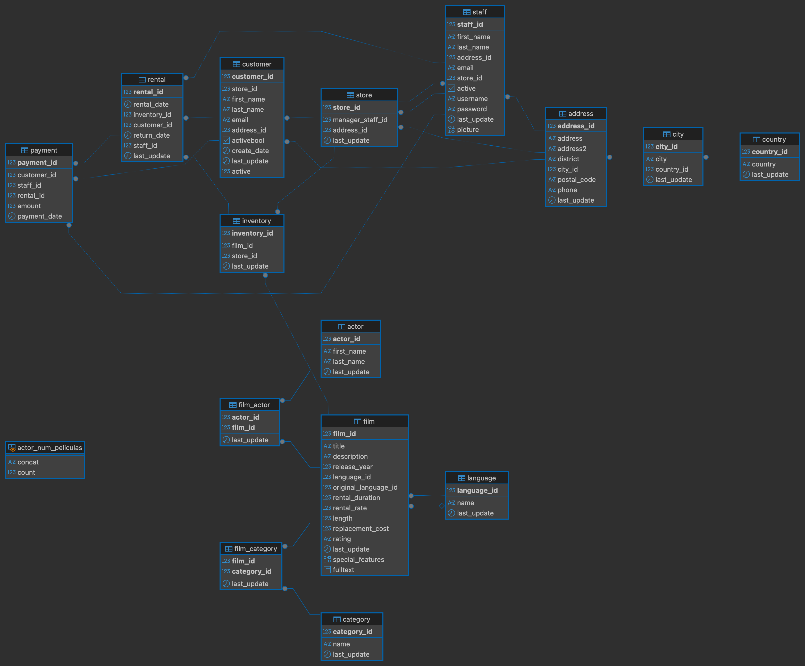

# 🎬 SQL Data Analysis – Videoclub Database

## 📖 Descripción

Este proyecto transforma datos crudos de una base relacional en insights accionables para la toma de decisiones estratégicas en un entorno de retail/alquiler.

El objetivo es aplicar SQL avanzado sobre la conocida base de datos 'Sakila' siguiendo una consigna práctica estructurada, que permite extraer insights de negocio e implementar de forma aplicada conceptos clave de modelado y análisis de datos.

---

## 🗂 Estructura del Proyecto

### 📁 data/
Contiene el archivo `BBDD_Proyecto.sql`, que incluye la creación de tablas y carga de datos.

Proceso de instalación y consultas SQL ejecutadas mediante **DBeaver** utilizando:
- Conexión local
- Puerto 5432
- Usuario: postgres
- Base de datos creada: `Videoclub`

Pasos realizados:
1. Descarga del archivo `BBDD_Proyecto.sql`
2. Creación de la base de datos `Videoclub`
3. Ejecución del script SQL para generar estructura y cargar datos
4. Exploración del esquema relacional para comprender relaciones entre tablas



### 📁 scripts/
Contiene el archivo `Scripts_Videoclub.sql` en el cual desarrollo 64 consultas siguiendo una consigna preestablecida. A partir de estas consultas y del análisis de los datos llego a las conclusiones y resultados que expongo a continuación.

---

## 📊 Resultados y Conclusiones

El análisis se centró en tres pilares fundamentales: **Operaciones, Gestión de Inventario y Comportamiento del Cliente.** 

La base de datos refleja la actividad de 2 sucursales durante los meses de Mayo a Agosto de 2005 y un registro adicional en Febrero de 2006.

### 🔎 1. Eficiencia Operativa y Ventas
* **Volumen de Negocio:** Se procesaron un total de **16,044 alquileres**, con un ticket promedio de **2.98 (u.m.)**.
* **Análisis de Estacionalidad:** Se identificó una tendencia creciente entre mayo y julio, alcanzando un pico máximo de demanda el **31 de julio de 2005 con 679 alquileres**.
* **Identificación de Anomalías:** El mes de febrero 2006 muestra una actividad inusualmente baja (182 alquileres), lo que sugiere un posible sesgo en la recolección de datos o un periodo de cierre parcial que amerita investigación adicional.

### 📈 2. Gestión de Inventario y Producto
* **Diversificación del Catálogo:** El inventario cuenta con **1,000 películas** distribuidas en **16 géneros**, ofreciendo una oferta balanceada para distintos segmentos de audiencia.
* **Rotación de Stock:** El tiempo promedio de alquiler real es de **4.98 días**. Comparar este dato con la duración permitida (`rental_duration`) permite identificar oportunidades para optimizar las políticas de recargos por mora y mejorar la disponibilidad de títulos populares.

### 👥 3. Inteligencia de Clientes
* **Fidelización:** Se identificó un segmento de **"Power Users"** (clientes con más de 7 películas distintas alquiladas). Esto permite al negocio diseñar programas de lealtad dirigidos a los 599 clientes registrados.
* **Geografía e Hipótesis:** La concentración de actividad en julio sugiere una correlación con temporadas invernales (hemisferio sur), donde el consumo de entretenimiento hogareño tiende a aumentar.

## 🌟 Consulta Destacada: Análisis de Impacto Temporal

A modo demostrativo del manejo de **subconsultas dinámicas** y **relaciones multi-tabla**, resalto esta consulta que identifica actores protagonistas de peliculas alquiladas con posterioridad a un hito específico: el primer alquiler de la película *'Spartacus Cheaper'*.

<details>
<summary><b>Ver consulta SQL</b></summary>

```sql
-- Identifica actores que participaron en películas alquiladas 
-- después del debut de 'Spartacus Cheaper' en el sistema.

SELECT DISTINCT 
    a.first_name AS NOMBRE, 
    a.last_name AS APELLIDO
FROM actor a
INNER JOIN film_actor fa ON a.actor_id = fa.actor_id
INNER JOIN film f ON fa.film_id = f.film_id
INNER JOIN inventory i ON f.film_id = i.film_id
INNER JOIN rental r ON i.inventory_id = r.inventory_id
WHERE r.rental_date > (
    -- Subconsulta dinámica para encontrar el hito temporal (mínima fecha)
    SELECT MIN(r2.rental_date)
    FROM rental r2
    INNER JOIN inventory i2 ON r2.inventory_id = i2.inventory_id
    INNER JOIN film f2 ON i2.film_id = f2.film_id
    WHERE f2.title = 'SPARTACUS CHEAPER'
)
ORDER BY APELLIDO ASC;
```

</details>

---

## 🧠 Habilidades Técnicas Demostradas

En este proyecto se implementaron soluciones técnicas avanzadas para asegurar la robustez y escalabilidad del análisis:

- **Subconsultas Dinámicas:** Utilizadas para comparar registros contra métricas globales (ej. identificar películas con duración superior al promedio) evitando el uso de valores estáticos (*hardcoding*).
- **CTEs (Common Table Expressions):** Implementación de tablas temporales para segmentar cálculos complejos, facilitando la lectura y el mantenimiento del código SQL.
- **Uniones Avanzadas (Joins):** Uso estratégico de `LEFT JOIN` para detectar ausencias de datos (ej. actores sin participación activa) e `INNER JOIN` para la integridad referencial en cruces multifactoriales.
- **Limpieza de Datos:** Aplicación de funciones de cadena como `TRIM` / `STRIP` y manejo de nulos con `IS NULL` para garantizar la precisión de los reportes.
- **Funciones de Agregación:** Uso de `COUNT(DISTINCT ...)` para métricas de unicidad y funciones temporales para el cálculo de intervalos reales de tiempo.

---

## 🛠 Tecnologías utilizadas

- SQL (PostgreSQL)
- DBeaver
- Base de datos relacional
- Análisis exploratorio mediante consultas

---

## 🔄 Próximos Pasos

- Segmentación de clientes
- Cálculo de rentabilidad por género y rango etario
- Visualización de resultados con herramientas BI

---

## 👨‍💻 Autor

**Rodrigo Antúnez**  
Data Analyst en formación con enfoque en análisis SQL y exploración de datos relacionales.

🔗 GitHub: https://github.com/rgoantunez  
🔗 Repositorio del proyecto: https://github.com/rgoantunez/Advanced_SQL_queries

---
